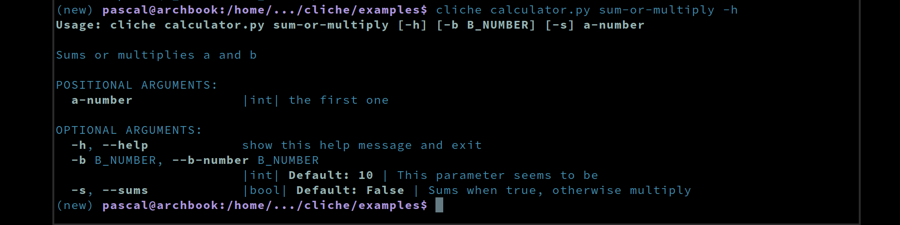

<p align="center">
  
</p>

# Cliche

Build a simple command-line interface from your functions.

Features:

- ✓ Least syntax required: you do not need to learn a "library" to use this
- ✓ keeps it DRY (Don't Repeat yourself):
  - it uses all information available like *annotations*, *default values* and *docstrings*... yet does not require them.
- ✓ Just decorate a function with `@cli` - that is it - it can now be called as CLI but also remains usable by other functions
- ✓ Works with booleans (flags) and lists (multiple args) automatically
- ✓ Standing on the shoulders of giants (i.e. it uses argparse and learnings from others) -> lightweight
- ✓ Outputs python objects to JSON (unless passing `--raw`)
- ✓ Colorized output
- ✓ Creates shortcuts, e.g. a variable "long_option" will be usable like `--long-option` and `-l`
- ✓ No external dependencies

## Examples

#### Simplest Example

You want to make a calculator. You not only want its functions to be reusable, you also want it to be callable from command line.

```python
# calculator.py
from cliche import cli

@cli
def add(a: int, b: int):
    print(a + b)
```

Now let's see how to use it from the command-line:

```
pascal@archbook:~/calc$ cliche install calc
pascal@archbook:~/calc$ calc add --help

usage: calc add [-h] a b

positional arguments:
  a           |int|
  b           |int|

optional arguments:
  -h, --help  show this help message and exit
```

thus:

    pascal@archbook:~/calc$ calc add 1 10
    11

#### Installation of commands

You noticed we ran

    cliche install calc

We can undo this with

    cliche uninstall calc

Note that installing means that all `@cli` functions will be detected in the folder, not just of a single file, even after installation. You only have to install once.

#### Advanced Example

```python
from cliche import cli

@cli
def add_or_mul(a_number: int, b_number: int = 10, sums: bool = False):
    """ Adds or multiplies a and b

    :param a_number: the first one
    :param b_number: This parameter seems to be
    :param sums: Sums when true, otherwise multiply
    """
    if sums:
        print(a_number + b_number)
    else:
        print(a_number * b_number)
```

Help:



Calling it:

    pascal@archbook:~/calc$ calc add_or_mul 1
    10

    pascal@archbook:~/calc$ calc add_or_mul --sum 1
    11

    pascal@archbook:~/calc$ calc add_or_mul --b_number 3 2
    6

#### More examples

Check the example files [here](https://github.com/kootenpv/cliche/tree/master/examples)

## Comparison with other CLI generators

  - argparse: it is powerful, but you need a lot of code to construct an argparse CLI
  - click: you need a lot of decorators to construct a CLI, and not obvious how to use it
  - hug (cli): connected to a whole web framework, but gets a lot right
  - python-fire: low set up, but annoying traces all the time / ugly design, does not show default values nor types
  - cleo: requires too much code/objects to construct
